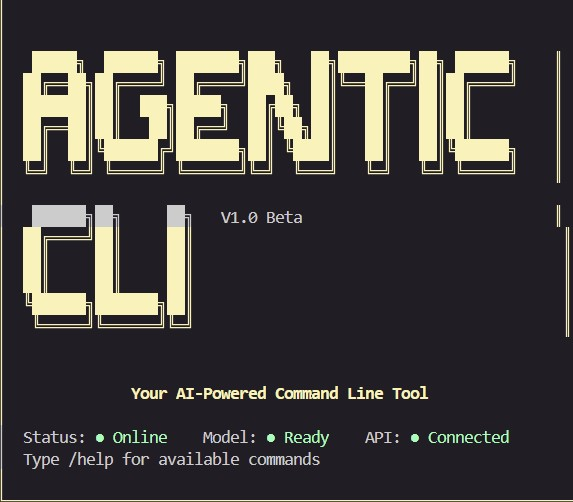
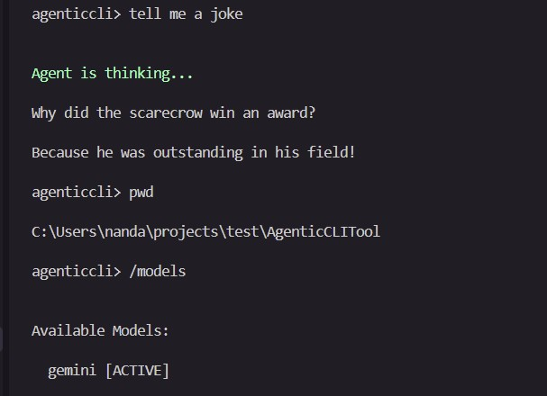
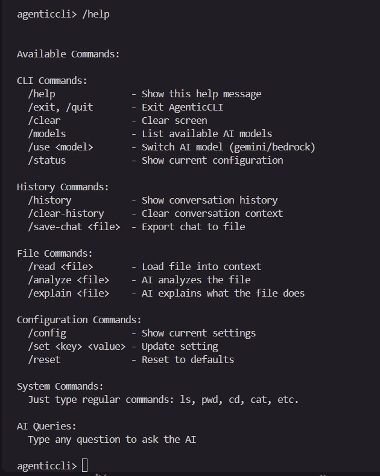
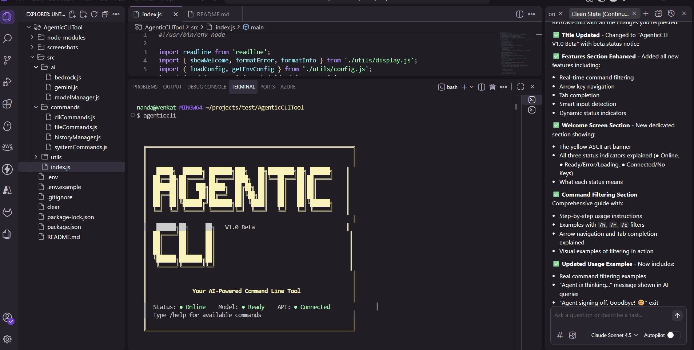

# AgenticCLI V1.0 Beta

AI-powered command line tool with support for Google Gemini 2.5 Flash Lite and AWS Bedrock Nova models.

> **Beta Notice**: This is a beta release. Features are stable but may be subject to changes based on user feedback.

## Features

- **Multi-Model AI Support** - Google Gemini 2.5 Flash Lite and AWS Bedrock Nova
- **Real-time Command Filtering** - Type `/` and see commands filter as you type
- **Arrow Key Navigation** - Navigate through filtered commands with ↑/↓ arrows
- **Tab Completion** - Press Tab to auto-complete selected commands
- **Smart Input Detection** - Automatically detects AI queries vs system commands
- **Dynamic Status Indicators** - Real-time display of system, model, and API status
- **Conversation History** - Maintains context across your session
- **File Operations** - Read, analyze, and explain files with AI
- **Configurable Preferences** - Customize temperature, tokens, and behavior
- **Cross-platform** - Works on Windows & Linux
- **Agent-themed Messages** - Friendly "Agent is thinking..." and goodbye messages

## Screenshots

### Welcome Screen with Status Indicators



### AI Queries and System Commands



### Help Command - All Available Commands



### Development Environment



## Welcome Screen

When you start AgenticCLI, you'll see a professional yellow ASCII art banner with real-time status indicators:

```text
  ╔═══════════════════════════════════════════════════════════════╗
  ║                                                               ║
  ║   █████╗  ██████╗ ███████╗███╗   ██╗████████╗██╗ ██████╗    ║
  ║  ██╔══██╗██╔════╝ ██╔════╝████╗  ██║╚══██╔══╝██║██╔════╝    ║
  ║  ███████║██║  ███╗█████╗  ██╔██╗ ██║   ██║   ██║██║         ║
  ║  ██╔══██║██║   ██║██╔══╝  ██║╚██╗██║   ██║   ██║██║         ║
  ║  ██║  ██║╚██████╔╝███████╗██║ ╚████║   ██║   ██║╚██████╗    ║
  ║  ╚═╝  ╚═╝ ╚═════╝ ╚══════╝╚═╝  ╚═══╝   ╚═╝   ╚═╝ ╚═════╝    ║
  ║                                                               ║
  ║   ██████╗██╗     ██╗   V1.0 Beta                            ║
  ║  ██╔════╝██║     ██║                                         ║
  ║  ██║     ██║     ██║                                         ║
  ║  ██║     ██║     ██║                                         ║
  ║  ╚██████╗███████╗██║                                         ║
  ║   ╚═════╝╚══════╝╚═╝                                         ║
  ║                                                               ║
  ║              Your AI-Powered Command Line Tool                ║
  ║                                                               ║
  ║  Status: ● Online    Model: ● Ready    API: ● Connected      ║
  ║  Type /help for available commands                            ║
  ║                                                               ║
  ╚═══════════════════════════════════════════════════════════════╝

  Active Model: gemini
```

### Status Indicators

The welcome screen shows three dynamic status indicators:

- **● Online** (Green) - AgenticCLI is running and ready
- **Model Status**:
  - **● Ready** (Green) - AI model initialized successfully
  - **● Error** (Red) - Model failed to initialize
  - **● Loading** (Yellow) - Model is initializing
- **API Status**:
  - **● Connected** (Green) - API keys are configured
  - **● No Keys** (Red) - Missing API keys in .env file

## Installation

1. Clone the repository

2. Install dependencies:

   ```bash
   npm install
   ```

3. Create `.env` file (copy from `.env.example`):

   ```bash
   cp .env.example .env
   ```

4. Add your API keys to `.env`:

   ```env
   # For Google Gemini
   GEMINI_API_KEY=your_gemini_api_key_here

   # For AWS Bedrock
   AWS_ACCESS_KEY_ID=your_aws_access_key
   AWS_SECRET_ACCESS_KEY=your_aws_secret_key
   AWS_REGION=us-east-1
   ```

5. Link globally:

   ```bash
   npm link
   ```

6. Run from anywhere:

   ```bash
   agenticcli
   ```

## Command Filtering & Navigation

AgenticCLI features real-time command filtering for easy command discovery:

### How to Use

1. **Type `/`** - Shows all available commands below your input
2. **Type `/h`** - Instantly filters to commands containing 'h': `/help`, `/history`, `/clear-history`, `/save-chat`
3. **Type `/r`** - Filters to: `/read`, `/clear`, `/clear-history`, `/reset`
4. **Type `/c`** - Filters to: `/clear`, `/config`, `/clear-history`, `/save-chat`
5. **Use ↑/↓ arrows** - Navigate through filtered commands
6. **Press Tab** - Auto-complete the selected command
7. **Press Enter** - Execute the selected command

### Example

```bash
agenticcli> /h

> /help
  /history
  /clear-history
  /save-chat
```

The first matching command is automatically selected (marked with `>`), making it quick to execute common commands.

### Filtering in Action

```bash
# Type /r to see read-related commands
agenticcli> /r

> /read
  /reset
  /clear
  /clear-history

# Use arrow keys to select /read, press Tab to complete
agenticcli> /read 

# Type /c to see clear/config commands
agenticcli> /c

> /clear
  /config
  /clear-history
  /save-chat
```

## Commands

### CLI Commands

- `/help` - Show all available commands
- `/exit` or `/quit` - Exit the tool (shows "Agent signing off. Goodbye! 😊")
- `/clear` - Clear screen
- `/models` - List available AI models
- `/use <model>` - Switch AI model (gemini or bedrock)
- `/status` - Show current configuration

### History Commands

- `/history` - Show conversation history
- `/clear-history` - Clear conversation context
- `/save-chat <filename>` - Export chat to file

### File Commands

- `/read <file>` - Load file into context
- `/analyze <file>` - AI analyzes the file
- `/explain <file>` - AI explains what the file does

### Configuration Commands

- `/config` - Show current settings
- `/set <key> <value>` - Update setting
- `/reset` - Reset to defaults

### System Commands

Just type regular commands like: `ls`, `pwd`, `cd`, `cat`, etc.

## Usage Examples

### Command Filtering

```bash
# Show all commands
agenticcli> /
> /help
  /exit
  /quit
  /clear
  /models
  ... (all commands shown)

# Filter commands as you type
agenticcli> /h
> /help
  /history
  /clear-history
  /save-chat

# Use arrows to select, Tab to complete, Enter to execute
agenticcli> /help
```

### Executing System Commands

```bash
agenticcli> ls
Documents  Downloads  Pictures  Projects

agenticcli> pwd
/home/user/projects

agenticcli> cat package.json
{
  "name": "my-project",
  ...
}
```

### AI Queries

When you ask a question, the agent shows a thinking message and responds:

```bash
agenticcli> what is nodejs?

Agent is thinking...

Node.js is a JavaScript runtime built on Chrome's V8 JavaScript engine. 
It allows you to run JavaScript on the server side, enabling you to build 
scalable network applications. Key features include:

- Event-driven, non-blocking I/O model
- NPM package ecosystem
- Cross-platform compatibility
- Built-in modules for file system, HTTP, etc.

agenticcli> explain async/await in javascript

Agent is thinking...

Async/await is a modern way to handle asynchronous operations in JavaScript...
```

The green **"Agent is thinking..."** message appears while the AI processes your query.

### Switching AI Models

```bash
agenticcli> /models

Available Models:

  gemini [ACTIVE]
  bedrock

agenticcli> /use bedrock
Success: Switched to bedrock

agenticcli> /status

Current Status:

Model: bedrock
Temperature: 0.7
Max Tokens: 2048
Auto-execute safe commands: false
History entries: 12
```

### File Operations

```bash
# Read a file into context
agenticcli> /read app.js
Success: Loaded app.js (2048 bytes) into context

# Ask AI about the file
agenticcli> what does this file do?

Agent is thinking...

This file is the main entry point for your application. It sets up an 
Express server, configures middleware, and defines routes...

# Analyze a file
agenticcli> /analyze src/utils/helper.js

Agent is thinking...

Code Analysis for helper.js:

Strengths:
- Well-structured utility functions
- Good error handling
- Clear function names

Suggestions:
- Add JSDoc comments for better documentation
- Consider adding input validation
- Extract magic numbers into constants

# Explain a file
agenticcli> /explain config.json

Agent is thinking...

This configuration file defines settings for your application:
- port: 3000 - The server will listen on port 3000
- database: Connection settings for MongoDB
- logging: Enables debug mode logging
...
```

### Saving Conversations

```bash
agenticcli> /save-chat my-session.txt
Success: Chat saved to: /home/user/.agenticcli-history/my-session.txt

agenticcli> /history

Conversation History:

[User]: what is nodejs?
[Assistant]: Node.js is a JavaScript runtime...

[User]: /read app.js
[Assistant]: [File loaded]

[User]: what does this file do?
[Assistant]: This file is the main entry point...
```

### Exiting

Exit the CLI with a friendly agent-themed message:

```bash
agenticcli> /exit

Agent signing off. Goodbye! 😊
```

You can also press `Ctrl+C` to exit anytime, which shows the same goodbye message.

## Configuration

Settings are saved in `~/.agenticcli-config.json`

### Available Settings

- `defaultModel` - gemini or bedrock (default AI model)
- `temperature` - 0.0 to 1.0 (AI creativity level, default: 0.7)
- `maxTokens` - Maximum response length (default: 2048)
- `colorEnabled` - Enable/disable colors (default: true)
- `autoExecuteSafe` - Auto-execute safe commands without confirmation (default: false)

### Managing Configuration

```bash
# View current settings
agenticcli> /config

Current Configuration:

  defaultModel: gemini
  temperature: 0.7
  maxTokens: 2048
  colorEnabled: true
  autoExecuteSafe: false

# Update a setting
agenticcli> /set temperature 0.9
Success: Set temperature = 0.9

agenticcli> /set defaultModel bedrock
Success: Set defaultModel = bedrock

# Reset to defaults
agenticcli> /reset
Reset all settings to defaults? (y/n): y
Success: Configuration reset to defaults
```

## Color Scheme

AgenticCLI uses a carefully designed color scheme for better readability:

- **Yellow** - Welcome banner ASCII art and box borders
- **Green** - Status indicators (● Online, ● Ready, ● Connected)
- **Green** - "Agent is thinking..." message
- **Red** - Error indicators (● Error, ● No Keys)
- **Cyan** - Active model display
- **White** - Standard text and command output

## Smart Input Detection

AgenticCLI automatically detects what you're trying to do:

- **Commands starting with `/`** - Treated as CLI commands
- **Common system commands** - Executed as shell commands (ls, pwd, cd, cat, etc.)
- **Questions and natural language** - Sent to AI for processing

Examples:

```bash
agenticcli> /help          # CLI command
agenticcli> ls -la         # System command
agenticcli> what is git?   # AI query
```

## Tips & Tricks

1. **Quick Command Access**: Type `/` and the first letter of a command, then press Tab
2. **Context Awareness**: Load files with `/read` before asking questions about them
3. **History Management**: Use `/clear-history` to start fresh conversations
4. **Model Switching**: Try different models for different tasks (Gemini for general, Bedrock for specific use cases)
5. **Save Important Chats**: Use `/save-chat` to export valuable conversations
6. **Arrow Navigation**: Use ↑/↓ to quickly select from filtered commands

## Troubleshooting

### Model Status Shows "● Error"

- Check your API keys in `.env` file
- Verify internet connection
- Ensure API keys have proper permissions

### API Status Shows "● No Keys"

- Create a `.env` file from `.env.example`
- Add at least one set of API keys (Gemini or Bedrock)

### Commands Not Working

- Make sure commands start with `/`
- Use `/help` to see all available commands
- Check for typos in command names

## License

ISC
